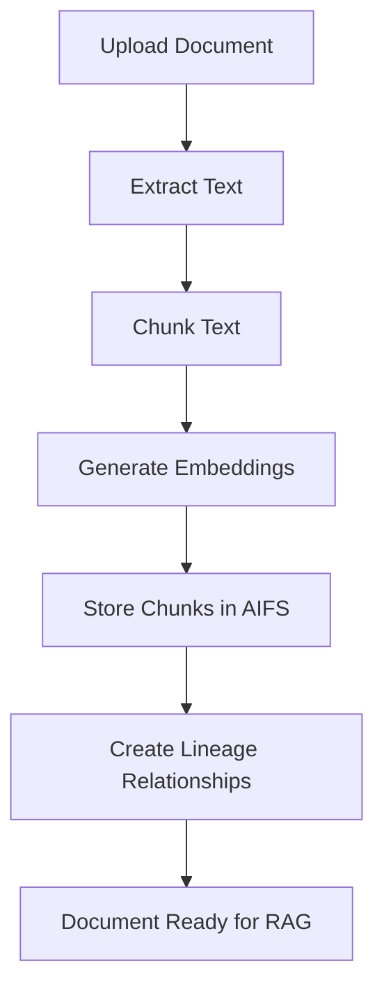
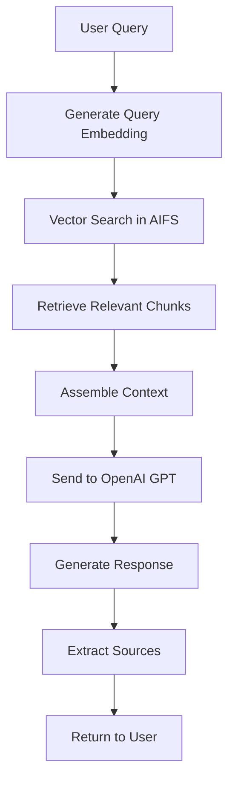

# AIFS Client App - RAG Integration Specification

## 🤖 **RAG Architecture Overview**

The RAG (Retrieval-Augmented Generation) system integrates OpenAI's GPT models with AIFS's vector search capabilities to provide intelligent document Q&A and content generation.

### High-Level RAG Flow
```
User Query → Document Retrieval → Context Assembly → LLM Generation → Response
     ↓              ↓                    ↓              ↓            ↓
  Query Vector → Vector Search → Chunk Selection → OpenAI API → Formatted Response
```

## 🔧 **RAG Components**

### 1. Document Processing Pipeline

#### 1.1 Text Extraction
```python
class DocumentProcessor:
    def extract_text(self, asset: Asset) -> str:
        """Extract text content from various file formats."""
        if asset.mime_type.startswith('text/'):
            return self._extract_text_file(asset)
        elif asset.mime_type == 'application/pdf':
            return self._extract_pdf(asset)
        elif asset.mime_type in ['application/msword', 'application/vnd.openxmlformats-officedocument.wordprocessingml.document']:
            return self._extract_word_document(asset)
        elif asset.mime_type == 'text/csv':
            return self._extract_csv(asset)
        else:
            return self._extract_generic(asset)
    
    def _extract_pdf(self, asset: Asset) -> str:
        """Extract text from PDF files."""
        import PyPDF2
        import io
        
        pdf_reader = PyPDF2.PdfReader(io.BytesIO(asset.data))
        text = ""
        for page in pdf_reader.pages:
            text += page.extract_text() + "\n"
        return text
    
    def _extract_word_document(self, asset: Asset) -> str:
        """Extract text from Word documents."""
        import docx
        
        doc = docx.Document(io.BytesIO(asset.data))
        text = ""
        for paragraph in doc.paragraphs:
            text += paragraph.text + "\n"
        return text
```

#### 1.2 Text Chunking
```python
class TextChunker:
    def __init__(self, chunk_size: int = 1000, chunk_overlap: int = 200):
        self.chunk_size = chunk_size
        self.chunk_overlap = chunk_overlap
    
    def chunk_text(self, text: str, asset_id: str) -> List[TextChunk]:
        """Split text into overlapping chunks for optimal retrieval."""
        chunks = []
        
        # Split by paragraphs first
        paragraphs = text.split('\n\n')
        current_chunk = ""
        chunk_index = 0
        
        for paragraph in paragraphs:
            if len(current_chunk) + len(paragraph) <= self.chunk_size:
                current_chunk += paragraph + "\n\n"
            else:
                if current_chunk:
                    chunks.append(TextChunk(
                        id=f"{asset_id}_chunk_{chunk_index}",
                        asset_id=asset_id,
                        content=current_chunk.strip(),
                        chunk_index=chunk_index,
                        start_char=0,  # Calculate actual position
                        end_char=len(current_chunk)
                    ))
                    chunk_index += 1
                
                # Start new chunk with overlap
                current_chunk = paragraph + "\n\n"
        
        # Add final chunk
        if current_chunk:
            chunks.append(TextChunk(
                id=f"{asset_id}_chunk_{chunk_index}",
                asset_id=asset_id,
                content=current_chunk.strip(),
                chunk_index=chunk_index,
                start_char=0,
                end_char=len(current_chunk)
            ))
        
        return chunks

class TextChunk(BaseModel):
    id: str
    asset_id: str
    content: str
    chunk_index: int
    start_char: int
    end_char: int
    embedding: Optional[List[float]] = None
    metadata: Dict[str, Any] = {}
```

### 2. Embedding Generation

#### 2.1 OpenAI Embeddings Integration
```python
class EmbeddingService:
    def __init__(self, api_key: str, model: str = "text-embedding-ada-002"):
        self.client = OpenAI(api_key=api_key)
        self.model = model
        self.dimension = 1536  # ada-002 dimension
    
    def generate_embedding(self, text: str) -> List[float]:
        """Generate embedding for text using OpenAI."""
        response = self.client.embeddings.create(
            input=text,
            model=self.model
        )
        return response.data[0].embedding
    
    def generate_embeddings_batch(self, texts: List[str]) -> List[List[float]]:
        """Generate embeddings for multiple texts efficiently."""
        response = self.client.embeddings.create(
            input=texts,
            model=self.model
        )
        return [data.embedding for data in response.data]
    
    def generate_chunk_embeddings(self, chunks: List[TextChunk]) -> List[TextChunk]:
        """Generate embeddings for text chunks."""
        texts = [chunk.content for chunk in chunks]
        embeddings = self.generate_embeddings_batch(texts)
        
        for chunk, embedding in zip(chunks, embeddings):
            chunk.embedding = embedding
        
        return chunks
```

### 3. Retrieval System

#### 3.1 Vector Search Integration
```python
class RetrievalService:
    def __init__(self, aifs_client: AIFSClient, embedding_service: EmbeddingService):
        self.aifs_client = aifs_client
        self.embedding_service = embedding_service
    
    def retrieve_relevant_chunks(self, query: str, context_assets: List[str], 
                                max_chunks: int = 10) -> List[RetrievalResult]:
        """Retrieve relevant text chunks for a query."""
        # Generate query embedding
        query_embedding = self.embedding_service.generate_embedding(query)
        
        # Search for relevant chunks
        search_results = self.aifs_client.vector_search(
            query_embedding=query_embedding,
            k=max_chunks * 2,  # Get more results for filtering
            filter_metadata={"type": "text_chunk"}
        )
        
        # Filter by context assets if specified
        if context_assets:
            search_results = [
                result for result in search_results
                if result['asset_id'] in context_assets
            ]
        
        # Convert to retrieval results
        retrieval_results = []
        for result in search_results[:max_chunks]:
            chunk = self._get_chunk_by_id(result['asset_id'])
            if chunk:
                retrieval_results.append(RetrievalResult(
                    chunk=chunk,
                    relevance_score=result['score'],
                    source_asset=result['asset_id']
                ))
        
        return retrieval_results
    
    def _get_chunk_by_id(self, chunk_id: str) -> Optional[TextChunk]:
        """Retrieve chunk metadata from AIFS."""
        # Implementation to get chunk from AIFS
        pass

class RetrievalResult(BaseModel):
    chunk: TextChunk
    relevance_score: float
    source_asset: str
    snippet: Optional[str] = None
```

### 4. Generation System

#### 4.1 OpenAI GPT Integration
```python
class GenerationService:
    def __init__(self, api_key: str, model: str = "gpt-4-turbo-preview"):
        self.client = OpenAI(api_key=api_key)
        self.model = model
    
    def generate_response(self, query: str, context_chunks: List[RetrievalResult],
                         conversation_history: List[Message] = None) -> RAGResponse:
        """Generate response using retrieved context."""
        # Prepare context
        context_text = self._prepare_context(context_chunks)
        
        # Build messages
        messages = self._build_messages(query, context_text, conversation_history)
        
        # Generate response
        response = self.client.chat.completions.create(
            model=self.model,
            messages=messages,
            temperature=0.7,
            max_tokens=4000
        )
        
        # Extract sources
        sources = self._extract_sources(context_chunks)
        
        return RAGResponse(
            content=response.choices[0].message.content,
            sources=sources,
            model_used=self.model,
            tokens_used=response.usage.total_tokens,
            generation_time=response.response_ms / 1000
        )
    
    def _prepare_context(self, chunks: List[RetrievalResult]) -> str:
        """Prepare context from retrieved chunks."""
        context_parts = []
        for i, chunk_result in enumerate(chunks, 1):
            context_parts.append(
                f"Source {i} (Relevance: {chunk_result.relevance_score:.2f}):\n"
                f"{chunk_result.chunk.content}\n"
            )
        return "\n".join(context_parts)
    
    def _build_messages(self, query: str, context: str, 
                       history: List[Message] = None) -> List[Dict]:
        """Build messages for OpenAI API."""
        system_prompt = """You are an AI assistant that helps users find and understand information from their documents. 
        Use the provided context to answer questions accurately and cite your sources.
        If you cannot find relevant information in the context, say so clearly."""
        
        messages = [{"role": "system", "content": system_prompt}]
        
        # Add conversation history
        if history:
            for msg in history[-10:]:  # Limit history
                messages.append({
                    "role": msg.role,
                    "content": msg.content
                })
        
        # Add current query with context
        user_message = f"""Context:
{context}

Question: {query}

Please answer the question based on the provided context. If you reference specific information, cite the source number."""
        
        messages.append({"role": "user", "content": user_message})
        return messages

class RAGResponse(BaseModel):
    content: str
    sources: List[Source]
    model_used: str
    tokens_used: int
    generation_time: float
    confidence_score: Optional[float] = None
```

### 5. RAG Orchestrator

#### 5.1 Main RAG Service
```python
class RAGService:
    def __init__(self, aifs_client: AIFSClient, openai_api_key: str):
        self.aifs_client = aifs_client
        self.document_processor = DocumentProcessor()
        self.text_chunker = TextChunker()
        self.embedding_service = EmbeddingService(openai_api_key)
        self.retrieval_service = RetrievalService(aifs_client, self.embedding_service)
        self.generation_service = GenerationService(openai_api_key)
    
    async def process_document(self, asset: Asset) -> ProcessingResult:
        """Process a document for RAG usage."""
        try:
            # Extract text
            text = self.document_processor.extract_text(asset)
            
            # Chunk text
            chunks = self.text_chunker.chunk_text(text, asset.id)
            
            # Generate embeddings
            chunks_with_embeddings = self.embedding_service.generate_chunk_embeddings(chunks)
            
            # Store chunks in AIFS
            stored_chunks = []
            for chunk in chunks_with_embeddings:
                chunk_asset = self.aifs_client.put_asset(
                    data=chunk.content.encode('utf-8'),
                    kind="text_chunk",
                    embedding=chunk.embedding,
                    metadata={
                        "parent_asset_id": asset.id,
                        "chunk_index": chunk.chunk_index,
                        "start_char": chunk.start_char,
                        "end_char": chunk.end_char,
                        "type": "text_chunk"
                    },
                    parents=[{
                        "asset_id": asset.id,
                        "transform_name": "text_chunking",
                        "transform_digest": hashlib.sha256(chunk.content.encode()).hexdigest()
                    }]
                )
                stored_chunks.append(chunk_asset)
            
            return ProcessingResult(
                success=True,
                chunks_created=len(stored_chunks),
                processing_time=time.time() - start_time
            )
            
        except Exception as e:
            return ProcessingResult(
                success=False,
                error=str(e),
                processing_time=time.time() - start_time
            )
    
    async def chat(self, query: str, conversation_id: str = None,
                  context_assets: List[str] = None,
                  context_folders: List[str] = None,
                  context_tags: List[str] = None) -> ChatResponse:
        """Handle a chat query with RAG."""
        try:
            # Expand context based on folders and tags
            expanded_context_assets = await self._expand_context(
                context_assets=context_assets,
                context_folders=context_folders,
                context_tags=context_tags
            )
            
            # Retrieve relevant chunks
            retrieval_results = self.retrieval_service.retrieve_relevant_chunks(
                query=query,
                context_assets=expanded_context_assets,
                max_chunks=10
            )
            
            # Get conversation history if provided
            conversation_history = []
            if conversation_id:
                conversation = await self.get_conversation(conversation_id)
                conversation_history = conversation.messages
            
            # Generate response
            rag_response = self.generation_service.generate_response(
                query=query,
                context_chunks=retrieval_results,
                conversation_history=conversation_history
            )
            
            # Create message objects
            user_message = Message(
                id=str(uuid.uuid4()),
                role="user",
                content=query,
                sources=[],
                created_at=datetime.utcnow()
            )
            
            assistant_message = Message(
                id=str(uuid.uuid4()),
                role="assistant",
                content=rag_response.content,
                sources=rag_response.sources,
                created_at=datetime.utcnow(),
                metadata={
                    "model_used": rag_response.model_used,
                    "tokens_used": rag_response.tokens_used,
                    "generation_time": rag_response.generation_time
                }
            )
            
            return ChatResponse(
                user_message=user_message,
                assistant_message=assistant_message,
                sources=rag_response.sources,
                conversation_id=conversation_id
            )
            
        except Exception as e:
            return ChatResponse(
                error=str(e),
                conversation_id=conversation_id
            )
    
    async def _expand_context(self, context_assets: List[str] = None,
                             context_folders: List[str] = None,
                             context_tags: List[str] = None) -> List[str]:
        """Expand context by including assets from folders and tags."""
        expanded_assets = set(context_assets or [])
        
        # Add assets from specified folders
        if context_folders:
            for folder_id in context_folders:
                folder_assets = await self.aifs_client.get_folder_contents(folder_id)
                expanded_assets.update([asset['id'] for asset in folder_assets])
        
        # Add assets with specified tags
        if context_tags:
            for tag in context_tags:
                tagged_assets = await self.aifs_client.get_assets_by_tags([tag])
                expanded_assets.update([asset['id'] for asset in tagged_assets])
        
        return list(expanded_assets)

class ProcessingResult(BaseModel):
    success: bool
    chunks_created: int = 0
    processing_time: float
    error: Optional[str] = None

class ChatResponse(BaseModel):
    user_message: Optional[Message] = None
    assistant_message: Optional[Message] = None
    sources: List[Source] = []
    conversation_id: Optional[str] = None
    error: Optional[str] = None
```

## 🔄 **RAG Workflow**

### 1. Document Processing Workflow


### 2. Query Processing Workflow


## ⚙️ **Configuration & Settings**

### 1. RAG Configuration
```python
class RAGConfig(BaseModel):
    # OpenAI Settings
    openai_api_key: str
    model: str = "gpt-4-turbo-preview"
    temperature: float = 0.7
    max_tokens: int = 4000
    
    # Embedding Settings
    embedding_model: str = "text-embedding-ada-002"
    embedding_dimension: int = 1536
    
    # Chunking Settings
    chunk_size: int = 1000
    chunk_overlap: int = 200
    max_chunks_per_query: int = 10
    
    # Retrieval Settings
    similarity_threshold: float = 0.7
    max_context_length: int = 8000
    
    # Generation Settings
    include_sources: bool = True
    max_conversation_history: int = 10
    enable_streaming: bool = False
```

### 2. Performance Optimization
```python
class RAGOptimizer:
    def __init__(self, config: RAGConfig):
        self.config = config
        self.embedding_cache = {}
        self.chunk_cache = {}
    
    def optimize_chunk_size(self, document_type: str) -> int:
        """Optimize chunk size based on document type."""
        optimizations = {
            "pdf": 1200,
            "docx": 1000,
            "txt": 800,
            "csv": 500,
            "code": 600
        }
        return optimizations.get(document_type, self.config.chunk_size)
    
    def cache_embeddings(self, chunks: List[TextChunk]):
        """Cache embeddings for faster retrieval."""
        for chunk in chunks:
            self.embedding_cache[chunk.id] = chunk.embedding
    
    def get_cached_embedding(self, chunk_id: str) -> Optional[List[float]]:
        """Retrieve cached embedding."""
        return self.embedding_cache.get(chunk_id)
```

## 📊 **Monitoring & Analytics**

### 1. RAG Metrics
```python
class RAGMetrics(BaseModel):
    # Query Metrics
    total_queries: int = 0
    average_response_time: float = 0.0
    average_tokens_used: float = 0.0
    
    # Retrieval Metrics
    average_chunks_retrieved: float = 0.0
    average_relevance_score: float = 0.0
    cache_hit_rate: float = 0.0
    
    # Generation Metrics
    average_generation_time: float = 0.0
    success_rate: float = 0.0
    error_rate: float = 0.0
    
    # Cost Metrics
    total_cost: float = 0.0
    cost_per_query: float = 0.0
    monthly_usage: Dict[str, float] = {}

class RAGMonitor:
    def __init__(self):
        self.metrics = RAGMetrics()
        self.query_logs = []
    
    def log_query(self, query: str, response_time: float, 
                  tokens_used: int, success: bool):
        """Log query metrics."""
        self.query_logs.append({
            "timestamp": datetime.utcnow(),
            "query": query,
            "response_time": response_time,
            "tokens_used": tokens_used,
            "success": success
        })
        
        # Update metrics
        self.metrics.total_queries += 1
        if success:
            self.metrics.average_response_time = (
                (self.metrics.average_response_time * (self.metrics.total_queries - 1) + response_time) 
                / self.metrics.total_queries
            )
            self.metrics.average_tokens_used = (
                (self.metrics.average_tokens_used * (self.metrics.total_queries - 1) + tokens_used) 
                / self.metrics.total_queries
            )
```

## 🔒 **Security & Privacy**

### 1. Data Privacy
```python
class RAGPrivacyManager:
    def __init__(self):
        self.sensitive_patterns = [
            r'\b\d{4}-\d{4}-\d{4}-\d{4}\b',  # Credit card
            r'\b\d{3}-\d{2}-\d{4}\b',        # SSN
            r'\b[A-Za-z0-9._%+-]+@[A-Za-z0-9.-]+\.[A-Z|a-z]{2,}\b'  # Email
        ]
    
    def sanitize_text(self, text: str) -> str:
        """Remove sensitive information from text."""
        sanitized = text
        for pattern in self.sensitive_patterns:
            sanitized = re.sub(pattern, '[REDACTED]', sanitized)
        return sanitized
    
    def check_content_policy(self, content: str) -> bool:
        """Check if content violates policies."""
        # Implement content policy checks
        return True
```

### 2. API Key Management
```python
class APIKeyManager:
    def __init__(self):
        self.encrypted_keys = {}
    
    def store_api_key(self, user_id: str, api_key: str):
        """Securely store API key."""
        encrypted_key = self._encrypt(api_key)
        self.encrypted_keys[user_id] = encrypted_key
    
    def get_api_key(self, user_id: str) -> Optional[str]:
        """Retrieve and decrypt API key."""
        encrypted_key = self.encrypted_keys.get(user_id)
        if encrypted_key:
            return self._decrypt(encrypted_key)
        return None
```

This comprehensive RAG integration specification provides a complete framework for building intelligent document Q&A capabilities within the AIFS client application.
